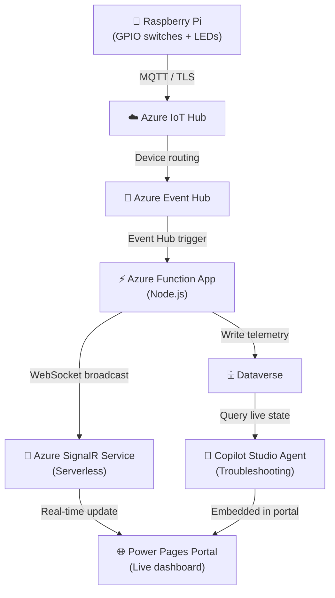

# AgenticIoT — Copilot IoT Service

An end-to-end IoT demonstration connecting physical hardware to Microsoft Power Platform, Azure cloud services, and Copilot Studio AI agents. A Raspberry Pi reads physical GPIO switches, sends telemetry to Azure, and the data surfaces in a real-time Power Pages portal with an AI troubleshooting agent.

---

## 🏗️ Architecture

> 📐 **Interactive diagram:** Open [`architecture.drawio`](./architecture.drawio) on GitHub for a pannable, zoomable version — rendered natively in the browser, no plugin needed.

**Data flow:** Physical switch toggle → IoT Hub → Event Hub → Azure Function → SignalR → live dashboard update in ~10 seconds.

---

## 🧩 Components

| Layer | Technology | Purpose |
|-------|-----------|----------|
| **Hardware** | Raspberry Pi + GPIO | 4 toggle switches, 4 LEDs, configurable logic map |
| **Device connectivity** | Azure IoT Hub (Standard S1) | MQTT device-to-cloud messaging |
| **Message buffer** | Azure Event Hub | Decouples IoT Hub from the processing pipeline |
| **Real-time backend** | Azure Function App (Node.js 24) | Receives Event Hub messages, broadcasts via SignalR |
| **Real-time transport** | Azure SignalR Service (Serverless) | WebSocket push to browser |
| **Data store** | Dataverse | IoT devices, telemetry events, panel state tables |
| **Portal** | Power Pages | Live dashboard + historical event log |
| **AI agent** | Copilot Studio | Panel Troubleshooting Agent — queries live state, walks through diagnostics |

---
