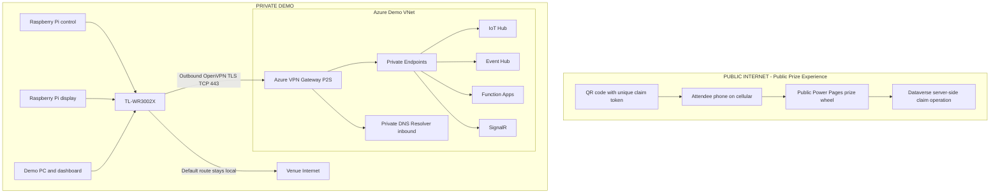
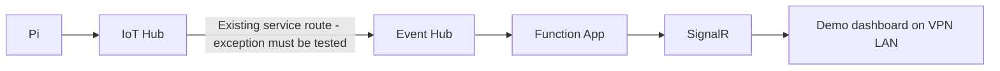

# Private demo network architecture

Status: **initial IaC/design only; live acceptance pending**. Track deployment and evidence in [issue #206](https://github.com/Andworx/copilot-iot-service/issues/206). Nothing in this change deploys Azure resources, changes application behavior or disables public connectivity.

## Discovery and ownership

The requested repository is `Andworx/copilot-iot-service`, distinct from the companion game repository. Its established provisioning is PowerShell with per-component JSON under `azure infrastructure/`. No Bicep/Terraform/ARM standard exists here, so `infra/` adds Bicep for networking. Preserve the existing scripts and resources; never replay old provisioning scripts as a network migration.

| Existing component | Repository evidence | Required confirmation before rollout |
|---|---|---|
| IoT Hub and DPS | `azure infrastructure/iot-hub`, `device-provisioning-service`; `scripts/New-AzureIotInfrastructure.ps1` | Live route authentication, enrollment and built-in endpoint access |
| Dedicated Event Hub | `azure infrastructure/event-hub`; middleware provisioning script | Live SKU can differ from the Basic config; all consumer groups and publishers |
| Legacy Functions | `azure infrastructure/azure-functions/config.json`, `iot-signalr-func/src/app.js` | Y1 configuration cannot support private networking; actual trigger settings decide dedicated versus built-in Event Hub |
| SignalR | `azure infrastructure/signalr/config.json` | Free_F1 config must become a supported paid SKU before PE |
| Storage and monitoring | `azure infrastructure/storage-account`, provisioning scripts | Functions host/checkpoint/content/deployment storage, Application Insights and ingestion |
| Dashboard | `power pages/iot-panel-dashboard` | Browser directly negotiates and connects to SignalR; browser must be on demo LAN |
| Shared game services and prizes | Companion game repository | Resource ownership, separate game Function, public prize dependencies and deployment pipeline |

Read-only Azure inventory was performed during discovery. Do not publish subscription IDs, private operational snapshots or secrets. Before deployment, keep an access-controlled inventory with exact IDs, effective settings and rollback values. Repository configs describe intended historical settings and can be stale; for example, verify Event Hub tier rather than deploying Basic from its JSON. Function docs disagree about built-in versus dedicated Event Hub; resolve using the non-secret effective hub-name/consumer-group settings and route metadata. Test both consumers before any shared-service restriction.

## Security zones (target)

No prize-zone route, peering or reverse proxy enters the VNet. This is the **required target**, not a claim that the current prize implementation already meets it. Dataverse remains a public SaaS dependency that private Functions may call outbound with least-privilege credentials. Shared Dataverse data does not create network transit; separate application permissions still matter.

## Decisions and gates before application changes

1. **Preserve service ownership.** Reference existing service IDs from endpoint modules. Shared Event Hub/SignalR changes must be reconciled with companion Bicep so the next deployment cannot reset a SKU or reopen public access. This repository owns the new network, not a second copy of the services.
2. **Public prizes are a hard gate.** Audit the wheel's network calls before lockdown. Any Function-based claim/list APIs must first move to a Dataverse/Power Pages server operation, with equivalent atomic stock allocation, single-use/expiring tokens, replay/idempotency handling and minimal permissions. Never replace a secure server claim with direct anonymous CRUD or client-side prize selection. That application change needs its own design and tests in its owning repository; this PR does not implement it.
3. **Private ingress is not service egress.** IoT Hub routes to Event Hub using its public service endpoint; its PE only handles ingress. Use managed identity with a scoped Event Hubs Data Sender assignment and validate the trusted-service exception. Test selected-network/default-deny and public-network-disabled behavior separately. If strict public disable blocks routing, record the constrained trusted-service exception as unmet strict acceptance; do not silently change the telemetry flow. [Microsoft routing guidance](https://learn.microsoft.com/en-us/azure/iot-hub/virtual-network-support).
4. **Hosting/SKU changes are separate.** Y1 needs a reviewed migration to a supported plan with parallel validation/rollback; no app/plan replacement is in the foundation. SignalR Free cannot have PEs, so approve the paid-tier cost first. Existing Flex apps use `Microsoft.App/environments` subnet delegation; Premium/Dedicated use `Microsoft.Web/serverFarms`. [Functions networking](https://learn.microsoft.com/en-us/azure/azure-functions/functions-networking-options), [SignalR limitations](https://learn.microsoft.com/en-us/azure/azure-signalr/howto-private-endpoints).
5. **Deployments must still work.** Hosted GitHub runners cannot reach private SCM/runtime endpoints by default. Before Function lockdown, validate the current deployment method against private access and provide an approved private runner or supported deployment mechanism. No public management IP is a substitute. Application workflow behavior stays unchanged in this initial PR.

## Address plan

| Use | Proposed CIDR | Reason |
|---|---|---|
| Demo VNet | `10.20.0.0/16` | One simple VNet; validate overlaps first |
| `GatewaySubnet` | `10.20.0.0/27` | Dedicated gateway subnet, no NSG/UDR |
| `private-endpoints` | `10.20.1.0/24` | NSG-controlled service interfaces |
| `function-integration` | `10.20.2.0/26` | Dedicated outbound integration, Flex default |
| `dns-inbound` | `10.20.3.0/28` | Dedicated resolver delegation; inbound IP `10.20.3.4` |
| P2S clients | `172.27.240.0/24` | Distinct VPN pool; router SNAT required |

No management/services subnet until a demonstrated need. Additional Function-plan subnet or WireGuard subnet requires reviewed IaC. Check all venue/LAN/VNet overlaps; one venue using these ranges can still break the POC. DNS infrastructure addresses belong in network configuration, never service IP literals in applications.

## Rollout and security

Follow [the phased issue](network-work-item.md) and [IaC procedure](../../infra/README.md). Capture baseline telemetry/latency, Function errors/lag, dashboard updates and cellular prize results first. Add foundation, prove VPN, add one endpoint, prove DNS and runtime, then consider a separate public-access change. A working router tunnel does not prove LAN reachability.

Use TLS and service authorization in addition to the VPN. Prefer managed identities for IoT routing and Functions; scope sender/receiver roles to the required hub and Dataverse application roles to necessary operations. Keep remaining credentials in Key Vault with identity-based access, after verifying platform support and rotation; do not move secrets into browser Vite values. Preserve existing telemetry/checkpoint permissions during transition.

Gateway diagnostics go to a new bounded Log Analytics workspace. Before rollout, configure actionable alerts for tunnel failures, no telemetry, Event Hub lag, Function failures, SignalR disconnects and logging quota; review Defender recommendations and costs. Keep existing Application Insights. NSGs restrict PE/DNS inbound traffic, but permissive Function egress remains until dependencies on Dataverse, identity, storage and monitoring are measured. No public SSH/RDP management interfaces are created.

Sources: [Event Hub Private Link and trusted services](https://learn.microsoft.com/en-us/azure/event-hubs/private-link-service), [Private DNS Resolver](https://learn.microsoft.com/en-us/azure/dns/dns-private-resolver-overview), [VPN SKU consolidation](https://learn.microsoft.com/en-us/azure/vpn-gateway/gateway-sku-consolidation). VPN design uses VpnGw1AZ rather than the retiring non-AZ SKU family. Exact price and regional availability need review before deployment.
