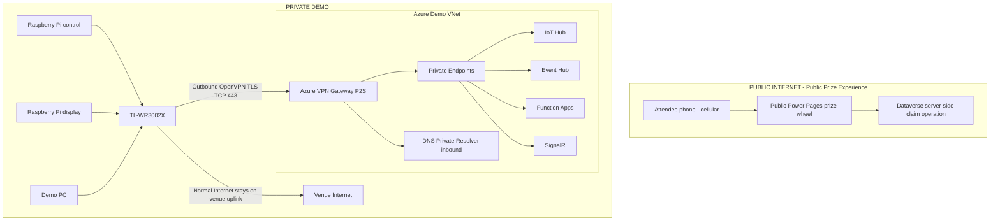

# Secure IoT Demo Network with Azure Private Networking and VPN

## Background

The portable demo uses a TL-WR3002X on venue Wi-Fi, Raspberry Pi control and display devices, and a demo PC. Preserve the live Pi → IoT Hub → Event Hub → Function → SignalR → dashboard flow while removing unnecessary public exposure. Attendees must redeem QR claim tokens over cellular Internet without joining the demo network.

## Discovery (2026-09-22)

- Requested repository: Andworx/copilot-iot-service. Existing provisioning uses PowerShell plus component JSON in `azure infrastructure/`; no Bicep/Terraform/ARM deployment standard found here. Introduce additive Bicep under `infra/`, retaining existing resources and scripts.
- Existing component configuration identifies IoT Hub, DPS, Event Hubs, SignalR, a legacy Function, storage and Application Insights. Reconcile current SKUs and networking against Azure before deployment; repository defaults are not authoritative live state.
- Shared ownership: the companion game repository also manages shared services with Bicep. Confirm ownership and coordinate SKU, firewall and identity changes there; never redeclare shared services in this template.
- Required dependency check: inspect the prize-wheel implementation for calls to Function APIs. If present, move claim validation and atomic redemption into an authorized Dataverse/Power Pages server operation before privatizing that Function. Preserve token entropy, expiry, one-use/idempotency, stock concurrency and minimal anonymous permissions. No browser Dataverse credentials or direct anonymous table-wide writes.
- Compatibility gate: classic Consumption Y1 lacks required private networking; a reviewed hosting migration may be necessary. SignalR Free cannot use private endpoints. Event Hubs requires a supported tier; verify live SKUs before changing anything.
- Blocker: IoT Hub egress routing does not traverse its ingress private endpoint. Validate managed identity, scoped Event Hubs Data Sender and trusted-service firewall behavior before restricting Event Hub. Do not promise a zero-public-endpoint route without a successful POC or an explicitly reviewed application change.

## Goals

- Private Azure networking, router-initiated VPN, private endpoints and private DNS.
- Preserve telemetry, downstream processing and dashboard events.
- Keep the public prize wheel independent of private IoT services.
- Store new Azure resources in IaC and document rollout, validation and rollback.

## Non-Goals

Redesigning the IoT application; making prizes private; replacing Dataverse or Power Pages; replacing working resources; deploying a WireGuard appliance before the OpenVPN POC fails.

## Architecture (target, gated by discovery blockers)

There is no public prize → VNet route, peering or proxy in the target. Dataverse remains a public SaaS dependency used outbound by authorized Functions; shared data is not a transit network. Application path stays Pi → IoT Hub → Event Hub → Function → SignalR → demo dashboard. IoT Hub → Event Hub requires the documented service routing exception, not an invented VNet path.

## Implementation Phases

- [x] Phase 1 — Discovery: repository convention and read-only resource inventory; record ownership and incompatibilities. Detailed dependency/secret-free settings inventory remains a rollout prerequisite.
- [ ] Phase 2 — Network Foundation: review and deploy additive VNet, subnets, NSGs, DNS resolver/zones and monitoring. Initial IaC must not disable public access.
- [ ] Phase 3 — VPN POC: configure P2S OpenVPN certificate auth; export Azure profile; import on TL-WR3002X; verify TLS/TCP 443, Pi private-IP reachability, LAN-to-tunnel SNAT/return routing, destination split routes, DNS and reboot/reconnect. A router tunnel alone is insufficient. Only if incompatible, design IaC for a WireGuard appliance; UDP blocking remains a venue risk.
- [ ] Phase 4 — Private Endpoints: IoT Hub first, then Event Hub, Functions and SignalR only after each hosting, ownership and routing prerequisite passes. Validate storage, DPS, deployments and both Function consumers.
- [ ] Phase 5 — DNS: test normal service FQDNs from both Pis, PC, Functions and off-VPN clients; no application private-IP literals.
- [ ] Phase 6 — Lockdown: separate reviewed changes per service after evidence; resolve public prize dependency and Event Hub trusted-service exception first. Validate cellular negative tests and production deployment access.
- [ ] Phase 7 — Documentation: finalize diagrams, setup, troubleshooting, cost estimate, rollback rehearsal and evidence links. Keep live results Verify until proven.

## Acceptance Criteria

- [ ] TL-WR3002X establishes VPN automatically, including after loss/restoration of venue Internet and reboot.
- [ ] Raspberry Pis need no VPN client; Pi reaches Azure private resources through the router.
- [ ] IoT Hub FQDN resolves to its private endpoint from the demo LAN.
- [ ] Pi → IoT Hub telemetry, Event Hub → both Function consumers and SignalR dashboard events work.
- [ ] Normal Internet egress remains the venue uplink (split tunneling).
- [ ] Prize wheel and QR redemption work from cellular without Function, SignalR, VNet or VPN access.
- [ ] Public attendee devices cannot perform data-plane operations against private IoT services.
- [ ] Credentials, profiles, certificates and private keys are absent from Git.
- [ ] New infrastructure is reproducible and idempotent; existing resources are referenced, not recreated.
- [ ] Network architecture, DNS, router setup, monitoring and rollback are documented.
- [ ] Public access changes occur only after validation; any unavoidable trusted-service exception is explicitly reviewed and tested.
- [ ] Cost/SKU changes, hosting migration, CI access, DPS provisioning, storage and managed identities are validated before final lockdown.

## Rollback

Capture non-secret service network policies and DNS configuration before each change. For an outage, restore the immediately previous public-network/firewall policy through its owning repository, verify public data-plane success, then remove the affected private DNS zone group/link or restore the LAN forwarder and clear caches. Leave other working endpoints intact. Re-enable the previous public route before reverting Function hosting/slot or routing changes; retain previous app configuration and consumer checkpoints securely. Disable router VPN routing to restore venue Internet only after Azure public access works. Incremental deployment and setting feature flags false do not delete deployed resources: use an explicit reviewed deletion by exact resource ID for additive resources after dependencies are removed. Do not delete shared hubs, namespaces, apps, storage or identities. Re-run telemetry, dashboard and cellular prize tests after every rollback.

## Delivery status

Initial deliverable: architecture documentation and additive IaC PR only. No Azure resources deployed, no application changes, no public access disabled. This tracking issue stays open after the initial PR; hardware POC and live acceptance remain pending.
